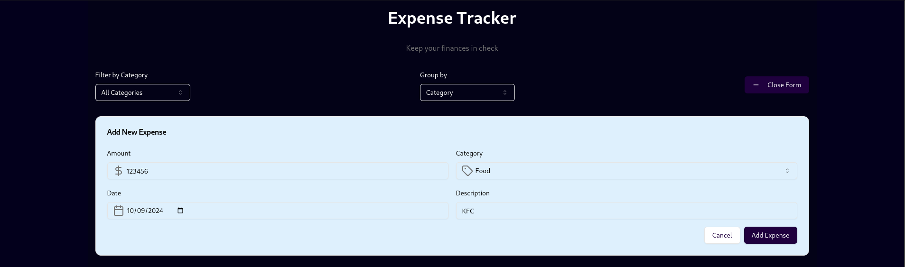

# Expense Tracker
A user-friendly Expense Tracker application built with React and TypeScript, designed to help users manage their expenses efficiently. Users can add, edit, delete, and categorize their expenses, providing a clear overview of their spending habits.
## Features
- **Add New Expense:** Users can enter details like amount, category, date, and description to add a new expense.
- **Edit Expense:** Existing expenses can be modified as needed.
- **Delete Expense:** Users can remove any expense from their list.
- **Categorization:** Expenses can be categorized (e.g., Food, Transportation, Entertainment) for better tracking and analysis.
- **Date Tracking:** Users can specify the date of each expense, helping to track spending over time.
- **Responsive Design:** The application is designed to be mobile-friendly and responsive.
- **Summary View:** Users can see a summary of their total expenses and categorize their spending.

## **Adding new expense**

## **Visualizing data with charts**

## **List of previously added expenses with edit and delete feature**

## **Very intuitive UI**

## **Responsive over multiple screen sizes**


## Technologies Used
- **React:** JavaScript library for building user interfaces.
- **TypeScript:** A typed superset of JavaScript that compiles to plain JavaScript.
- **Tailwind CSS:** A utility-first CSS framework for styling the application.
- **Lucide React:** A library of SVG icons for React.
- **npm:** Package manager for JavaScript.
## Installation
To run this project locally, follow these steps:
1. **Clone the repository:**
   ```bash
   git clone https://github.com/yourusername/expense-tracker.git
   cd expense-tracker
